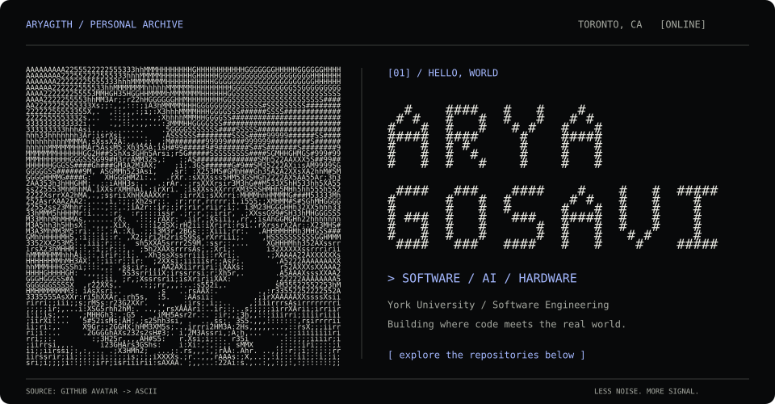
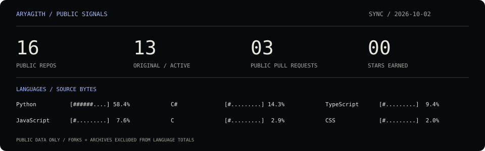

[](https://aryas-portfolio.vercel.app)

<p align="center">
  <a href="https://aryas-portfolio.vercel.app"><code>[ portfolio ]</code></a> &nbsp; / &nbsp;
  <a href="https://www.linkedin.com/in/arya-gosavi-42063421b/"><code>[ linkedin ]</code></a> &nbsp; / &nbsp;
  <a href="https://github.com/aryagith?tab=repositories"><code>[ all repositories ]</code></a>
</p>

```text
$ whoami
arya gosavi / software engineering @ york university
toronto, ca / ai + full-stack + systems that touch the real world
```

### `01 / selected work`

**GPU / AI / computer vision**

| Project | What it does | Stack |
| :--- | :--- | :--- |
| [**cuda-gpt2-inference**](https://github.com/aryagith/cuda-gpt2-inference) | Custom attention and fused GPT-2 inference kernels, with accuracy checks and benchmarks. | `CUDA` `Python` |
| [**conv2d-bench**](https://github.com/aryagith/conv2d-bench) | 2D convolution baselines and CUDA kernels in a GPU optimization lab. | `CUDA` `Python` |
| [**rocket-track**](https://github.com/aryagith/rocket-track) | Tracks rockets through launch footage using YOLOv8 and SORT. | `Python` `OpenCV` `TensorRT` |

**Tools / automation**

| Project | What it does | Stack |
| :--- | :--- | :--- |
| [**incident-atlas**](https://github.com/aryagith/incident-atlas) | Service-metrics investigation dashboard with root-cause ranking evaluation. | `Python` |
| [**ariadne**](https://github.com/aryagith/ariadne) | Local internship discovery and resume tailoring workflow. | `Python` |

**Web / interactive systems**

| Project | What it does | Stack |
| :--- | :--- | :--- |
| [**quizzle**](https://github.com/aryagith/quizzle) | AI-generated quizzes with saved games and performance history. [Open app ↗](https://quizzle-seven.vercel.app) | `Next.js` `TypeScript` `Prisma` |
| [**captioner**](https://github.com/aryagith/captions-generator-webapp) | Video upload, transcription, editable captions, and subtitle export. | `Next.js` `AWS` `FFmpeg` |
| [**visuomotor lab**](https://github.com/aryagith/visuomotor-adaptation-lab) | Webcam body tracking and Unity experiments with altered visual feedback. | `Unity` `C#` `MediaPipe` |

### `02 / the lab`

```text
experiments/
|-- bytebattle          live data + LLM headlines for a smart mirror
|-- ecommerce-chatbot   comparing text representations for intent classification
`-- neetcode            algorithms, one problem at a time
```

[bytebattle](https://github.com/aryagith/bytebattle) · [ecommerce-chatbot](https://github.com/aryagith/ecommerce-chatbot) · [neetcode-submissions](https://github.com/aryagith/neetcode-submissions)

### `03 / public signals`

[](https://github.com/aryagith?tab=repositories)

<sub>Updated daily from GitHub's API. Languages are measured by source bytes across public, original, active repositories.</sub>

---

```text
$ echo "build it. measure it. make it better."
```

<details>
<summary><code>[ view the raw ASCII portrait ]</code></summary>

The portrait in the header is made of text characters sampled from my GitHub avatar. [Open the plain-text version](assets/portrait.txt).

</details>
